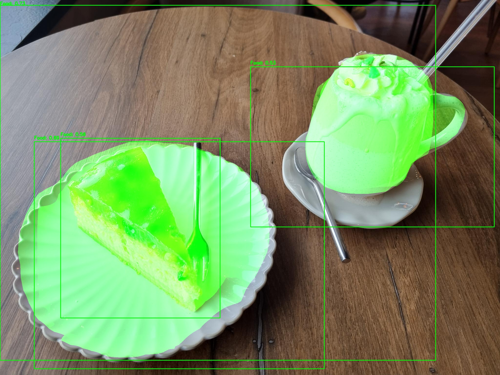
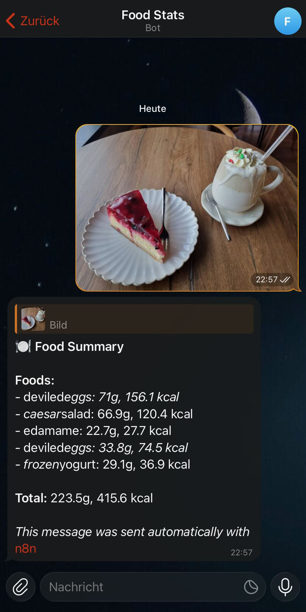

# Food Stats

> Calories calculator based on food images.

## Table of Contents

* [Introduction](#introduction)
* [Features](#features)
* [Screenshots](#screenshots)
* [Datasets](#datasets)
* [Usage](#usage)
* [Acknowledgements](#acknowledgements)

## Introduction

- This API provides an endpoint for analyzing images containing food.
- It provides the amount of calories based on the food type and portion size.
- The setup is meant to be integrated into a n8n workflow interfacing with a Telegram bot.

## Features

- Compatible with 100 types of food
- Adjustable calorie values and portion sizes
- Expandable with more training data

## Screenshots

**!!! NOTE: These screenshots show predictions of the development models after very short training. The production models will be much better after longer training.**

 
*Input image*

 
*Segmented image (without the classification)*

 
*Telegram chat (using the API in a n8n workflow)*

## Datasets

- [Food Segmentation](https://huggingface.co/datasets/EduardoPacheco/FoodSeg103)
- [Food Classification](https://huggingface.co/datasets/ethz/food101)
- [Food Nutrition](https://huggingface.co/datasets/openfoodfacts/product-database)

## Usage

### Training

- Use `uv sync` to install all necessary dependencies.
- Clone all datasets from HuggingFace in the [Datasets](#datasets) section into the `/data` directory.
- Run `uv run src/dev/segmentation/prepare_dataset.py` and `uv run src/dev/classification/prepare_dataset.py` to prepare the HuggingFace datasets for training.
- Run `uv run src/dev/segmentation/training.py` and `uv run src/dev/classification/training.py` to train the segmentation and classification model.
- Run `uv run src/dev/segmentation/inference.py` and `uv run src/dev/segmentation/inference.py` to test the inference with the trained models.
- Copy the trained models from `/data/segmentation/model/model_final.pth` and `/data/classification/model/model_final.pth` to `/bin/segmentation/model_final.pth` and `/bin/classification/model_final.pth`.

### Inference

- Make sure that the segmentation and classification models are located in the `/bin` directory (either use the shipped models or train your own).
- Deploy the Docker stack with `docker compose up -d`.
- Access the API on `http://localhost:8080` (see `/docs` for the API endpoints).

## Acknowledgements

This project was inspired by myself, since there was no suitable alternative.

*Original idea in December 2025*
